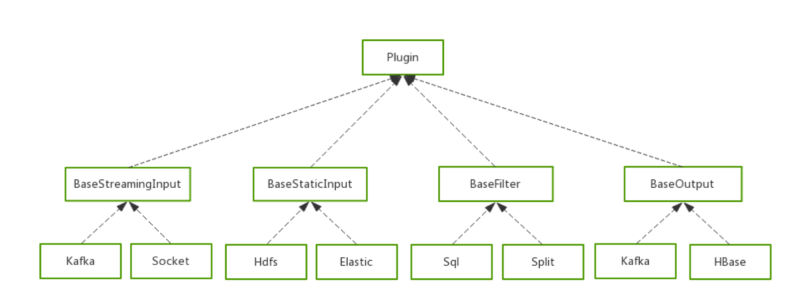
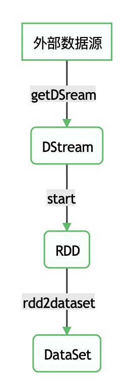
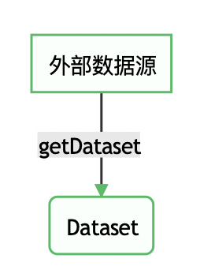
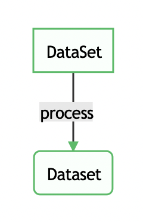
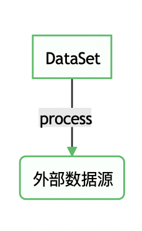
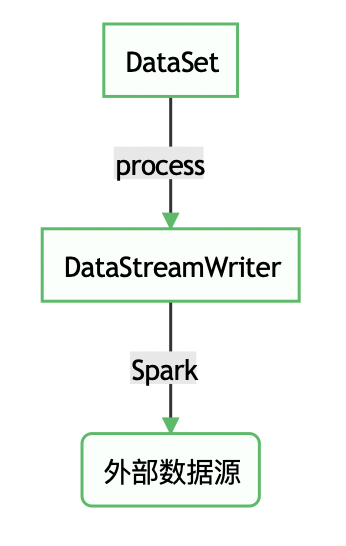

本文面向所有 seatunnel 插件开发人员，尽可能清晰得阐述开发一个 seatunnel 插件所经历的过程，希望能消除开发者的困惑。

## seatunnel 为什么需要插件机制

1. 原生提供插件可能仅能满足80%的需求，还有20%需要你自己来开发
2. 有了插件机制，开发仅需关注特定插件的处理逻辑，数据处理的共性问题，由框架来统一处理。
3. 通用插件大大提升了代码的复用率。

## seatunnel 插件体系介绍

seatunnel 插件分为3部分，`Input` 、`filter` 和 `output`，这里贴一个简版类图

<p align="center">
    
</p>


### Input 

`Input` 插件主要负责从外部读取数据并且封装为 `Spark DataSet[Row]` 数据集。插件有三种类型，分别是：

1. 读取静态离线数据的 `BaseStaticInput`
2. 实时数据流处理 `BaseStreamingInput`，并且我们在此接口基础上开发了方便 Java 使用的 `BaseJavaStreamingInput`
3. 状态的实时流处理 `BaseStructuredStreamingInput`

### Filter

`Filter` 插件主要负责处理类型为 `Spark DataSet[Row]` 的输入，并且返回同样为 `Spark DataSet[Row]` 类型的数据集。

### Output

`Output` 插件则负责将 `Spark DataSet[Row]` 数据集输出到外部数据源或者将结果打印到终端。


## 如何开发一个插件

### 第一步，创建项目

创建项目或者直接拉取本项目代码

> git clone https://github.com/InterestingLab/seatunnel-example.git

当你看到这里的，相比这一步不用过多阐述

### 第二步，配置seatunnel-api依赖

**sbt**
```
libraryDependencies += "io.github.interestinglab.waterdrop" %% "waterdrop-apis" % "1.5.0"
```

**maven**
```
<dependency>
    <groupId>io.github.interestinglab.waterdrop</groupId>
    <artifactId>waterdrop-apis_2.11</artifactId>
    <version>1.5.0</version>
</dependency>
```

### 第三步，继承并实现接口

#### 1. Input

新建一个类，并继承 **waterdrop-apis** 提供的父类并实现相关接口完成 `Input` 插件开发。

##### 1.1 StreamingInput

`BaseStreamingInput` 用于实现一个流式处理 `Input` 插件，它支持泛型，用户可以根据实际数据情况指定类型。

需要注意，seatunnel 中的流式计算插件，类名必须以 **Stream** 结尾，如 `hdfsStream`。

`BaseStreamingInput` 接口定义如下：

```scala
abstract class BaseStreamingInput[T] extends Plugin {

  /**
   * Things to do after filter and before output
   * */
  def beforeOutput: Unit = {}

  /**
   * Things to do after output, such as update offset
   * */
  def afterOutput: Unit = {}

  /**
   * This must be implemented to convert RDD[T] to Dataset[Row] for later processing
   * */
  def rdd2dataset(spark: SparkSession, rdd: RDD[T]): Dataset[Row]

  /**
   * start should be invoked in when data is ready.
   * */
  def start(spark: SparkSession, ssc: StreamingContext, handler: Dataset[Row] => Unit): Unit = {

    getDStream(ssc).foreachRDD(rdd => {
      val dataset = rdd2dataset(spark, rdd)
      handler(dataset)
    })
  }

  /**
   * Create spark dstream from data source, you can specify type parameter.
   * */
  def getDStream(ssc: StreamingContext): DStream[T]
```

`BaseStreamingInput` 接口功能如下：

* `beforeOutput`: 定义调用 Output 之前的逻辑。
* `afterOutput`: 定义调用 Output 之后的逻辑，常用于维护 Offset 实现 *at-least-once* 语义
* `rdd2dataset`: 定义 **RDD[T]** 转换为 **DataSet[Row]** 的处理逻辑
* `start`: 内部操作逻辑，可以无需关心
* `getDStream`: 定义获取外部数据源数据的逻辑，需要生成 **DStream[T]**

总的来说，我们需要定义外部数据源转换为 **DataSet[Row]** 的逻辑。

<p align="center">
    
</p>


##### 1.2 BaseStaticInput

`BaseStaticInput` 用于实现一个离线/静态数据源读取插件，接口定义如下

```
abstract class BaseStaticInput extends Plugin {

  /**
   * Get Dataset from this Static Input.
   * */
  def getDataset(spark: SparkSession): Dataset[Row]
}
```

接口功能如下：

* `getDataset`: 将外部数据源转换为 **DataSet[Row]**

<p align="center">
    
</p>


##### 1.3 BaseStructuredStreamingInput

`BaseStructuredStreamingInput` 接口定义与 `BaseStaticFilter` 定义类似，此处不再做过多陈述。


#### 2. Filter

新建一个类，并继承 **waterdrop-apis** 提供的父类并实现相关接口完成 `Filter` 插件开发。

##### BaseFilter

Spark 较好实现了批流一体，因此我们的 `Filter` 插件仅有一套API，且大部分 `Filter` 插件都能同时支持批处理和流处理。

`BaseFilter` 接口定义如下：

```
abstract class BaseFilter extends Plugin {

  def process(spark: SparkSession, df: Dataset[Row]): Dataset[Row]

  /**
   * Allow to register user defined UDFs
   * @return empty list if there is no UDFs to be registered
   * */
  def getUdfList(): List[(String, UserDefinedFunction)] = List.empty

  /**
   * Allow to register user defined UDAFs
   * @return empty list if there is no UDAFs to be registered
   * */
  def getUdafList(): List[(String, UserDefinedAggregateFunction)] = List.empty
}
```

`BaseFilter` 接口功能如下：

`process`: 定义 `Filter` 插件的具体操作逻辑，方法输入和输出都是 **DataSet[Row]**
`getUdfList`: 定义需要被注册的 UDF 列表
`getUdafList`: 定义需要被注册的 UDAF 列表

大部分场景我们仅需要实现 `process` 方法定义数据处理逻辑即可。

<p align="center">
    
</p>

#### 3. Output

新建一个类，并继承 **waterdrop-apis** 提供的父类并实现相关接口完成 `Output` 插件开发。

##### 3.1 BaseOutput

`BaseOutput` 插件支持批处理和 Spark Streaming，不支持 Spark Structured Streaming

`BaseOutput` 接口定义如下:

```scala
abstract class BaseOutput extends Plugin {

  def process(df: Dataset[Row])
}
```

`BaseOutput` 接口功能如下:

`process`: 定义 **Dataset[Row]** 数据输出到外部数据源的方法，需要注意，这里需要触发一个 `action` 操作

<p align="center">
    
</p>


##### 3.2 BaseStructuredStreamingOutputIntra

`BaseStructuredStreamingOutputIntra` 则是为了提供 Spark Structured Streaming 对外输出的插件。

`BaseStructuredStreamingOutputIntra` 接口定义

```scala
trait BaseStructuredStreamingOutputIntra extends Plugin {

  def process(df: Dataset[Row]): DataStreamWriter[Row]
}
```

`BaseStructuredStreamingOutputIntra` 接口功能：

`process`: 与 `BaseOutput` 不同的是，这里返回的是 **DataStreamWriter[Row]**。

<p align="center">
    
</p>

##### 3.3 BaseStructuredStreamingOutput

`BaseStructuredStreamingOutputIntra` 主要为了提供 Spark 现在的 Output 方法支持，而 `BaseStructuredStreamingOutput` 则是为了自定义输出数据源。

`BaseStructuredStreamingOutput` 接口定义如下：

```scala
trait BaseStructuredStreamingOutput extends ForeachWriter[Row] with BaseStructuredStreamingOutputIntra {

  /**
   * Things to do before process.
   * */
  def open(partitionId: Long, epochId: Long): Boolean

  /**
   * Things to do with each Row.
   * */
  def process(row: Row): Unit

  /**
   * Things to do after process.
   * */
  def close(errorOrNull: Throwable): Unit

  /**
   * seatunnel Structured Streaming process.
   * */
  def process(df: Dataset[Row]): DataStreamWriter[Row]
}
```

`BaseStructuredStreamingOutput` 接口功能如下：

`open`: 定义处理之前的逻辑
`process`: 定义每条数据的处理逻辑
`close`: 定义处理之后的逻辑
`process`: seatunnel 内部的处理逻辑，需要返回 **DataStreamWriter[Row]**

<p align="center">
    
</p>


### 第四步，打包使用

1. 编译打包
2. 将打包后的 Jar 包放到 seatunnel 指定目录下，以便 seatunnel 在启动的时候可以加载到。

```shell
cd seatunnel
mkdir -p plugins/my_plugins/lib
cd plugins/my_plugins/lib
```

seatunnel需要将第三方Jar包放到，必须新建**lib**文件夹

> plugins/your_plugin_name/lib/your_jar_name

其他文件放到
> plugins/your_plugin_name/files/your_file_name

3. 在配置文件中使用插件

第三方插件在使用时，**必须使用插件的完整包路径**，例如

> org.interestinglab.seatunnel.output.JavaOutput

```
output {                                        
    org.interestinglab.seatunnel.output.JavaStdout {
        limit = 2
    }
}
```

### 第五步， 启动

至此，我们就完成了一个插件的开发，并且在 seatunnel 中使用这个插件。
